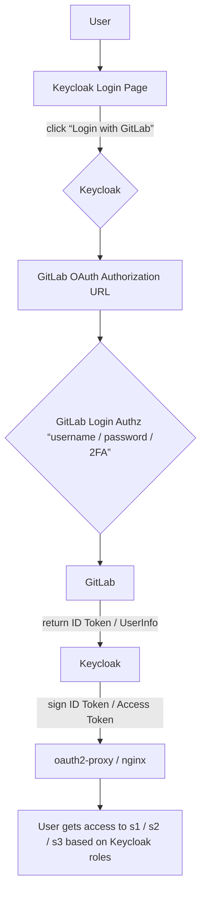

# Keycloak Integration with GitLab and OAuth2-Proxy: A Comprehensive Guide
[English](/en/keycloak-gitlab-oauth2proxy.md) | [Japanese](/ja/keycloak-gitlab-oauth2proxy.md) | [Chinese](/zh/keycloak-gitlab-oauth2proxy.md)
## Introduction

This guide provides a comprehensive overview and detailed steps for integrating GitLab as an Identity Provider (IdP) with Keycloak acting as an authorization service and Identity Broker, secured by oauth2-proxy and Nginx. This setup aims to leverage existing GitLab authentication while enhancing authorization capabilities through Keycloak.

### Core Principles:

*   ✅ **GitLab** is responsible for **Identity Authentication (AuthN)**.
*   ✅ **Keycloak** is responsible for **Authorization Management (AuthZ)**.
*   ✅ **Keycloak** acts as an **Identity Broker**, trusting identity results issued by GitLab during user login and locally establishing or synchronizing user profiles and roles.

## 1. Objectives and Requirements

### 1.1 Purpose:

1.  To extend existing GitLab authentication to provide a unified authentication service for various web services under the same root domain and its subdomains.
2.  To enhance Role-Based Access Control (RBAC) functionality for fine-grained user permission control.

### 1.2 Requirements:

1.  Provide role/group-based access control for project-team-oriented web services (e.g., Resin services).
2.  Provide user/group-based access control for individual user-oriented web services (e.g., Resin services).

## 2. Solution Overview

### 2.1 Proposed Solution:

*   Keycloak acts as an Identity Broker, integrating with GitLab OAuth (i.e., GitLab Login → Keycloak Token → Your Application).
*   No manual user import is required; users continue to use their GitLab accounts for login (including 2FA).

### 2.2 Benefits:

*   Keycloak handles RBAC and time-based policies.
*   GitLab retains existing users and 2FA configurations.
*   No user password migration is needed.
*   Comprehensive features: User/Group/Role management, Fine-grained Authorization (Resources, Permissions, Policies), and conditional logic using JavaScript (e.g., time-based conditions).
*   Supports GitLab as an Identity Broker: Users log in with GitLab, but Keycloak manages roles and permissions.
*   Active community and extensive documentation facilitate management backend, auditing, and temporary authorization (e.g., automated role assignment/revocation for specific periods via Admin API scripts).

### 2.3 High-Level Architecture Diagram:

User ──▶ Nginx ─▶ oauth2-proxy ─▶ Keycloak (Identity Broker) ─▶ GitLab (IdP)

### 2.4 High-Level Login Flow:

Web Service → oauth2-proxy → Keycloak → GitLab Login (OAuth) → Returns Token → Web Service.

**Result:**

*   User authentication still occurs at GitLab.
*   Keycloak generates its own Token and issues it to oauth2-proxy.
*   Roles and policies can be assigned in Keycloak to these "external login users."

## 3. Core Concepts

### 3.1 GitLab vs. Keycloak Capabilities Comparison:

| Feature                            | GitLab                                       | Keycloak                                                                   |
| :--------------------------------- | :------------------------------------------- | :------------------------------------------------------------------------- |
| User Authentication (Username/Password, OAuth2) | ✅ Supports local users, LDAP, SAML, 2FA       | ✅ Supports local users, LDAP, SAML, OTP, FIDO2, WebAuthn                  |
| OAuth2 / OIDC Provider             | ✅ Built-in Provider (limited functionality)   | ✅ Full support including Access Tokens, Refresh Tokens, UMA, Resource Policy |
| User Grouping / Roles              | ✅ Based on Projects/Groups                    | ✅ Customizable Realm Roles / Client Roles / Groups, Hierarchical          |
| Fine-grained Access Control (RBAC / ABAC) | ❌ Minimal                                     | ✅ Powerful, built-in Policy / Permission model, extensible with JS conditions (e.g., time-based) |
| Identity Federation (Integration with other IdPs) | ✅ Can act as IdP or integrate with external IdPs | ✅ Can act as IdP or **as a Broker** to integrate with GitLab, Google, Azure AD, etc. |
| Multi-Factor Authentication (2FA/MFA) | ✅ TOTP (Google Authenticator) + WebAuthn      | ✅ TOTP, WebAuthn (FIDO2), SMS/Email, OTP (extensible)                     |

### 3.2 Understanding Keycloak as an "Identity Broker"

The "Identity Broker" is a **core feature of Keycloak**. It acts as middleware, allowing Keycloak to **trust external Identity Providers (IdPs)** and issue its own tokens based on that trust.

#### Analogy: Double-Layer Issuance at Airport Security

Imagine the login process like a "double-layer issuance" at airport security:

1.  ✈️ **GitLab is the passport issuing authority**:
    *   It verifies who the user is (account, password, 2FA) and declares, "This is legitimate user A."

2.  🛂 **Keycloak is the border control officer (Broker)**:
    *   It trusts the authenticity of the passport (verified via OAuth2 / OIDC signature) and decides which areas this traveler can access (RBAC roles).
    *   It then issues its own internal "boarding pass" (Access Token / ID Token).
    *   This token contains role, permission, and other relevant information.

3.  🧱 **Nginx + oauth2-proxy or backend services only recognize Keycloak's Token**.
    *   They do not need to be aware of GitLab's existence.

### 3.3 Detailed Login Flow (Sequence Diagram)



### 3.4 Identity Broker Data Flow and User Synchronization

#### User Information Synchronization Logic:

When a GitLab user logs in via Keycloak for the first time:

*   Keycloak will fetch from GitLab:
    *   `email`
    *   `username`
    *   `name` (`display_name`)
    *   `avatar_url`
    *   `gitLab ID` (`sub` claim)

*   Keycloak then creates a "federated user" internally, designated as a "brokered user."
    *   (You will see this user in the Admin Console, marked as "Federated.")
*   The next time the user logs in, Keycloak automatically identifies them (via GitLab's `sub` claim) and updates their information.
*   Keycloak does not need to actively synchronize with the GitLab user table periodically. It creates users **on-demand** upon their first login and subsequently maintains their information automatically. This is known as **"Just-In-Time Provisioning."**

## 4. Detailed Configuration Steps

### 4.1 Step 1: Configure Keycloak as Identity Broker for GitLab

#### 4.1.1 Register Keycloak as an OAuth Application in GitLab

**Path:** `GitLab → Admin → Applications` (or `User Settings → Applications`)

**Fill in:**

| Field          | Value                                                              |
| :------------- | :----------------------------------------------------------------- |
| Name           | `keycloak-broker`                                                  |
| Redirect URI   | `https://keycloak.example.com/realms/yourrealm/broker/gitlab/endpoint` |
| Scopes         | `read_user openid profile email`                                   |

**Obtain:**

*   Client ID
*   Client Secret

#### 4.1.2 Configure GitLab Identity Provider in Keycloak

**Path:** `Login to Keycloak Admin Console → Create a new Realm (e.g., my-realm) → Enter the Realm`
`→ Identity Providers → Add provider → Select "OpenID Connect v1.0" (or "GitLab" if available as a direct option)`

**Fill in:**

| Setting             | Value                                                          |
| :------------------ | :------------------------------------------------------------- |
| Alias               | `gitlab`                                                       |
| Display name        | `Login with GitLab`                                            |
| Authorization URL   | `https://gitlab.its2.mbpsmartec.co.jp/oauth/authorize` (or your self-hosted GitLab address) |
| Token URL           | `https://gitlab.its2.mbpsmartec.co.jp/oauth/token`             |
| User Info URL       | `https://gitlab.its2.mbpsmartec.co.jp/api/v4/user`             |
| Client ID           | (ID obtained from GitLab in the previous step)                 |
| Client Secret       | (Secret obtained from GitLab in the previous step)             |
| Default Scopes      | `read_user openid profile email`                               |
| Store Tokens        | ✅ Enable                                                      |

After saving, a "Login with GitLab" button will automatically appear on the Keycloak login page.

#### 4.1.3 Enable Automatic User Creation & Email Mapping

*   In the Identity Provider settings, check the following:
    *   `Sync Mode: IMPORT`
    *   `Trust Email`
    *   `Store Tokens`
    *   `Sync Mode: On First Login`

This ensures that Keycloak will automatically import and save the user's basic profile upon their first login.

#### 4.1.4 Assign Keycloak Local Roles

Once a GitLab user logs in for the first time, a corresponding user will appear in Keycloak. You can then navigate to:

`Keycloak → Users → (select user) → Role Mappings`

Here, you can assign the user permissions to access services like `s1/s2/s3`. You can also create policies to control access, e.g., mapping a specific GitLab group to a Keycloak role or dynamically granting authorization based on time.

### 4.2 Step 2: Configure Keycloak Client for oauth2-proxy

#### 4.2.1 Create Client in Keycloak

**Path:** `Login to Keycloak Admin Console → Select the appropriate Realm`
`→ Clients → Create client`

**Fill in:**

*   Client ID: `oauth2proxy`
*   Client Protocol: `openid-connect`
*   Access Type: `confidential`
*   Valid Redirect URIs:
    *   `https://s1.web.local/oauth2/callback`
    *   `https://s2.web.local/oauth2/callback`
    *   `https://s3.web.local/oauth2/callback`

#### 4.2.2 Configure oauth2-proxy

1.  In the "Credentials" tab of the Keycloak client, copy the client secret.
2.  In the oauth2-proxy configuration, set the following:
    *   `provider = "oidc"`
    *   `oidc_issuer_url = "https://keycloak.local/realms/myrealm"`
    *   `oidc_client_id = "oauth2proxy"`
    *   `oidc_client_secret = "xxxxxxxxxxxx"` (The client secret copied from Keycloak)
    *   `redirect_url = "https://s1.web.local/oauth2/callback"`
    *   `scope = "openid email profile"`
    *   `email_domains = ["*"]`
    *   `cookie_secret = "RANDOM_32_BYTE_KEY"`

## 5. Advanced Configurations

### 5.1 Enabling OTP in Keycloak

1.  Log in to the Keycloak Master Realm Administration Console.
2.  Switch to your target realm.
3.  Navigate to `Authentication → Flows → Browser`. Confirm the flow structure:

    ```
    Username Password Form
    ↓
    OTP Form
    ```

    If `OTP Form` is present, change its `Requirement` to `REQUIRED`. If `OTP Form` is not present:
    *   Click "Add execution" in the top right.
    *   Select `OTP Form` from the list.
    *   Save, and then change its `Requirement` to `REQUIRED`.

This means all users logging in via the browser will be required to use OTP.

4.  **Binding OTP during login:**
    *   Log out and log back into the administration console.
    *   The system will prompt: "Configure OTP, Scan this QR code with your Authenticator app."
    *   Scan the QR code and enter a verification code once.
    *   From now on, all logins will require both your password and OTP.

### 5.2 Higher Security Measures

| Item                         | Description                                                               |
| :--------------------------- | :------------------------------------------------------------------------ |
| 🔑 **Admin Console Restriction** | Use Nginx / firewall to restrict access to `/auth/admin/` to internal networks only. |
| 🧩 **Enforce Password Policy** | In `Realm Settings → Password Policy`, enforce strong password requirements and periodic updates. |
| 🧱 **Disable Direct Access**   | Disable public client access to the master realm.                         |
| 📦 **External Secrets**        | Store admin passwords/OTP keys in a Vault or Azure Key Vault.             |

### 5.3 Keycloak Proxy Modes Explained

| Mode            | Description                                                                                                                                                | Use Case                                          |
| :-------------- | :--------------------------------------------------------------------------------------------------------------------------------------------------------- | :------------------------------------------------ |
| **`none`**      | Keycloak is directly exposed to the public network without a proxy layer, handling HTTPS entirely on its own.                                                | Only for development/testing (e.g., `start-dev`). |
| **`edge`**      | Most common. Keycloak assumes it is behind a reverse proxy (e.g., Nginx), where the proxy terminates HTTPS and then forwards HTTP. Keycloak trusts `X-Forwarded-*` headers. | ✅ Recommended for Nginx, Traefik, HAProxy, etc.  |
| **`reencrypt`** | Indicates that communication between the reverse proxy and Keycloak still uses HTTPS (the proxy re-encrypts and forwards). Keycloak still trusts `X-Forwarded-*`. | Used when Nginx→Keycloak communication also uses HTTPS (e.g., internal network with certificates). |
| **`passthrough`** | No protocol handling; Keycloak directly handles external HTTPS connections (rarely used).                                                                   | Special high-security environments.               |

### 5.4 Extending: GitLab SSO via Keycloak

To make GitLab itself use Keycloak for Single Sign-On (SSO):

*   In GitLab: Navigate to `Admin → Settings → Integrations → Enable OIDC / SAML`.
*   Fill in Keycloak's Metadata.

This configuration achieves "Company Internal Unified Login Entrance: Keycloak" for all internal systems, including GitLab.

## 6. Troubleshooting Common Issues

### 6.1 Email Not Verified Error

**Error:** `Error redeeming code during OAuth2 callback: email in id_token (xg.wang@mbpsmartec.co.jp) isn't verified.`

**Causes:**
*   OAuth2-Proxy by default requires the email in the ID Token to be verified (`email_verified=true`).
*   Keycloak has `email_verified=true` selected in its settings.

**Solutions:**
*   **OAuth2-Proxy Configuration:** Add `insecure_oidc_allow_unverified_email = true` to the oauth2-proxy configuration.
*   **Keycloak Realm Settings:** In `Realm → Login → Email settings`, set `Verify email = false`.

### 6.2 Setting GitLab as Default IdP with Auto-Redirect

**Problem:** You want Keycloak to act as an Identity Broker, setting GitLab as the default identity provider with automatic redirection, without displaying the username/password input fields.

**Solution:** This can be achieved through a custom Authentication Flow.

*   In `Authentication → Flows`, copy the "browser" flow to create a new flow (e.g., `browser-login-by-gitlab`).
*   Add an "Identity Provider Redirector" execution to this new flow.
*   Configure the "Identity Provider Redirector" to set `Default Identity Provider = gitlab` (using the alias you configured for the GitLab IdP).
*   **Crucially, associate this custom flow with your client (e.g., oauth2-proxy client)**. Other clients can still use the default username/password login.
    *   Client `→ Settings (Advanced) → Authentication Flow Overrides → Browser Flow = browser-login-by-gitlab`.

### 6.3 Understanding "Identity Provider Redirector"

According to official documentation:
When using IdP Federation (i.e., Keycloak as a Broker delegating authentication to an external IdP), Keycloak by default displays a username/password form along with external IdP login buttons on the login page.
If you wish to **skip the username/password form** and **automatically redirect the user to a configured external IdP** (e.g., your GitLab login button), then use the "Identity Provider Redirector" executor.
By adding and configuring the "Identity Provider Redirector" in the Login flow (Browser Flow), Keycloak will automatically redirect to the specified IdP on the login interface, instead of first displaying the local username/password form.

### 6.4 User Creation/Association Issues on First Login

**Problem:** Upon first access to a web service, the user is redirected to the GitLab login page. After successful GitLab authorization, they are redirected back to Keycloak, which then requests a username/password, failing to automatically create or link the user, thus preventing further authentication.

**Possible Causes and Checkpoints:**

*   **Keycloak Identity Provider Advanced Settings Check:**
    *   Navigate to `Identity Providers → GitLab` (your configured IdP) `→ Advanced Settings`.
    *   Confirm:
        *   `First Login Flow Override: first broker login`
        *   `Sync Mode: Import`
*   **Keycloak Authentication Flows Check (`First Broker Login`):**
    *   Navigate to `Authentication → Flows → First Broker Login` (or your custom flow if configured). If no custom flow is set, use the default.
    *   Check if it includes the "Create User If Unique" execution, and ensure its `Requirement` is `REQUIRED` or `ALTERNATIVE`.
    *   Check if it includes the "Automatically Set Existing User" execution.
    *   Check if "Review Profile" or "Update Profile On First Login" is set to "On" to allow users to supplement missing information.

### 6.5 Setup Process: Enabling "Identity Provider Redirector" in a Realm

Here's a recommended detailed procedure, applicable to an environment where a realm (e.g., `intra-mart`) uses GitLab as an external IdP.

1.  **Confirm External IdP Configuration:**
    *   In your realm (e.g., `intra-mart`): `Identity Providers → Add provider` (select OIDC or GitLab).
    *   Fill in GitLab's Client ID / Secret, Authorization endpoint, UserInfo endpoint, etc.
    *   Ensure "Enabled" is checked.

2.  **Create or Modify the Browser Login Flow:**
    *   From the left menu: `Authentication → Flows`.
    *   Locate the "Browser" flow (the default flow) or copy it to create a new flow (e.g., `browser-idp-only`) to avoid affecting other clients.
    *   In this flow: Add a new execution "Identity Provider Redirector" (click "Add execution").
    *   Change the `Requirement` of "Identity Provider Redirector" to `REQUIRED`.
    *   Click the "⚙ (Config)" icon to the right of this execution to configure it:
        *   `Alias`: Set this to the "Alias" value you defined for GitLab in `Identity Providers` (e.g., `gitlab`).
        *   `Default Identity Provider`: Also fill in this Alias (e.g., `gitlab`).
        *   (Other options are available to control redirection based on user domain matching or the presence of the `kc_idp_hint` parameter.)

3.  **Point the Client to This Login Flow:**
    *   In your realm (e.g., `intra-mart`): `Clients → Select your client` (e.g., `oauth2-proxy client`).
    *   In the `Settings` or `Authentication Flow Overrides` section: Set the `Browser Flow` to the flow you just created or modified (e.g., `browser-idp-only`).
    *   Save.
