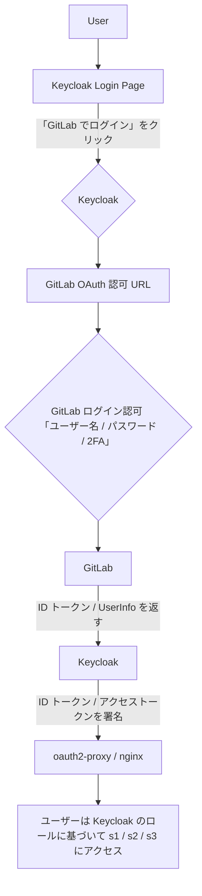

--- 
title: Keycloak と GitLab および OAuth2-Proxy の統合：包括的なガイド
description: Keycloak と GitLab および OAuth2-Proxy の統合：包括的なガイド
published: true
date: 2025-11-13T09:01:38.206Z
tags: keycloak, gitlab, oauth2proxy
editor: markdown
dateCreated: 2025-11-13T09:01:30.330Z
---

# GitLab (IdP) + Keycloak（認可サービス / ブローカーとして） + oauth2-proxy/nginx
[English](/keycloak-gitlab-oauth2proxy.md) | [Japanese](/ja/keycloak-gitlab-oauth2proxy.md) | [Chinese](/zh/keycloak-gitlab-oauth2proxy.md)

## はじめに

このガイドでは、GitLab を ID プロバイダー (IdP) として、Keycloak を認可サービスおよび ID ブローカーとして統合し、oauth2-proxy と Nginx で保護するための包括的な概要と詳細な手順を提供します。この設定は、既存の GitLab 認証を活用し、Keycloak を介して認可機能を強化することを目的としています。

### コア原則：

*   ✅ **GitLab** は **ID 認証 (AuthN)** を担当します。
*   ✅ **Keycloak** は **認可管理 (AuthZ)** を担当します。
*   ✅ **Keycloak** は **ID ブローカー** として機能し、ユーザーログイン時に GitLab が発行する ID 結果を「信頼」し、ローカルでユーザープロファイルとロールを確立または同期します。

## 1. 目的と要件

### 1.1 目的：

1.  既存の GitLab 認証を拡張し、同じルートドメインとそのサブドメイン下のさまざまな Web サービスに統一された認証サービスを提供します。
2.  ロールベースのアクセス制御 (RBAC) 機能を強化し、きめ細やかなユーザー権限制御を実現します。

### 1.2 要件：

1.  プロジェクトチーム指向の Web サービス（例：Resin サービス）に対して、ロール/グループベースのアクセス制御を提供します。
2.  個別ユーザー指向の Web サービス（例：Resin サービス）に対して、ユーザー/グループベースのアクセス制御を提供します。

## 2. ソリューション概要

### 2.1 提案されたソリューション：

*   Keycloak は ID ブローカーとして機能し、GitLab OAuth と連携します（つまり、GitLab ログイン → Keycloak トークン → あなたのアプリケーション）。
*   手動でのユーザーインポートは不要です。ユーザーは引き続き GitLab アカウントを使用してログインします（2FA を含む）。

### 2.2 利点：

*   Keycloak は RBAC と時間ベースのポリシーを処理します。
*   GitLab は既存のユーザーと 2FA 設定を保持します。
*   ユーザーパスワードの移行は不要です。
*   包括的な機能：ユーザー/グループ/ロール管理、きめ細やかな認可（リソース、権限、ポリシー）、JavaScript を使用した条件ロジック（例：時間ベースの条件）。
*   GitLab を ID ブローカーとしてサポート：ユーザーは GitLab でログインしますが、Keycloak がロールと権限を管理します。
*   活発なコミュニティと豊富なドキュメントにより、管理バックエンド、監査、一時的な認可（例：Admin API スクリプトを介した特定の期間のロールの自動割り当て/取り消し）が容易になります。

### 2.3 高レベルアーキテクチャ図：

ユーザー ──▶ Nginx ─▶ oauth2-proxy ─▶ Keycloak (ID ブローカー) ─▶ GitLab (IdP)

### 2.4 高レベルログインフロー：

Web サービス → oauth2-proxy → Keycloak → GitLab ログイン (OAuth) → トークンを返す → Web サービス。

**結果：**

*   ユーザー認証は引き続き GitLab で行われます。
*   Keycloak は独自のトークンを生成し、oauth2-proxy に発行します。
*   これらの「外部ログインユーザー」には、Keycloak でロールとポリシーを割り当てることができます。

## 3. コアコンセプト

### 3.1 GitLab と Keycloak の機能比較：

| 機能                             | GitLab                                       | Keycloak                                                                   |
| :------------------------------- | :------------------------------------------- | :------------------------------------------------------------------------- |
| ユーザー認証（ユーザー名/パスワード、OAuth2）    | ✅ ローカルユーザー、LDAP、SAML、2FA をサポート       | ✅ ローカルユーザー、LDAP、SAML、OTP、FIDO2、WebAuthn をサポート                  |
| OAuth2 / OIDC プロバイダー             | ✅ 内蔵プロバイダー（機能は限定的）                          | ✅ アクセストークン、リフレッシュトークン、UMA、リソースポリシーを含む完全なサポート |
| ユーザーグループ化/ロール                      | ✅ プロジェクト/グループに基づく                                 | ✅ カスタマイズ可能なレルムロール/クライアントロール/グループ、階層型              |
| きめ細やかなアクセス制御（RBAC / ABAC）    | ❌ 最小限                                   | ✅ 強力な組み込みポリシー/権限モデル、JS 条件で拡張可能（例：時間ベース）            |
| ID フェデレーション（他の IdP との統合）        | ✅ IdP として機能するか、外部 IdP と統合可能                  | ✅ IdP として機能するか、GitLab、Google、Azure AD などと統合するための **ブローカーとして** 機能可能   |
| 多要素認証（2FA/MFA）            | ✅ TOTP (Google Authenticator) + WebAuthn | ✅ TOTP, WebAuthn (FIDO2), SMS/Email, OTP (拡張可能)             |

### 3.2 Keycloak を「ID ブローカー」として理解する

「Identity Broker（ID ブローカー）」は **Keycloak のコア機能** です。これはミドルウェアとして機能し、Keycloak が **外部 ID プロバイダー (IdP) を信頼** し、その信頼に基づいて独自のトークンを発行できるようにします。

#### 例え：空港のセキュリティにおける二重発行

ログインプロセスを空港のセキュリティにおける「二重発行」のように想像してみてください。

1.  ✈️ **GitLab はパスポート発行機関です**：
    *   ユーザーが誰であるか（アカウント、パスワード、2FA）を確認し、「これは正当なユーザー A です」と宣言します。

2.  🛂 **Keycloak は国境警備官（ブローカー）です**：
    *   パスポートの信頼性（OAuth2 / OIDC 署名によって検証済み）を信頼し、この旅行者がアクセスできる領域（RBAC ロール）を決定します。
    *   次に、独自の内部「搭乗券」（アクセストークン/ID トークン）を発行します。
    *   このトークンには、ロール、権限、その他の関連情報が含まれています。

3.  🧱 **Nginx + oauth2-proxy またはバックエンドサービスは Keycloak のトークンのみを認識します**。
    *   彼らは GitLab の存在を知る必要はありません。

### 3.3 詳細なログインフロー（シーケンス図）

```mermaid
sequenceDiagram
    participant User
    participant Nginx
    participant Oauth2Proxy
    participant Keycloak
    participant GitLab

    User->>+Nginx: ① https://s1.web.local にアクセス
    Nginx->>Oauth2Proxy: ② リクエストを転送
    Oauth2Proxy-->>Keycloak: ③ セッションなし、Keycloak ログインページにリダイレクト
    Keycloak->>User: Keycloak ログインページ
    User->>Keycloak: ④ 「GitLab でログイン」をクリック
    Keycloak->>+GitLab: ⑤ ユーザーを GitLab ログインにリダイレクト
    GitLab->>User: GitLab ログインページ（資格情報 + 2FA）
    User->>GitLab: ⑥ 資格情報を入力 + 2FA 検証済み
    GitLab-->>-Keycloak: ⑦ 認可コードを返す
    Keycloak->>GitLab: ⑧ 認可コードを使用してユーザー情報（メール、名前など）を取得
    Keycloak->>Keycloak: ⑨ 内部ユーザーマッピングを作成/更新（パスワードなし、GitLab を参照）
    Keycloak-->>-Oauth2Proxy: ⑩ アクセストークン/ID トークンを発行
    Oauth2Proxy->>Oauth2Proxy: ⑪ トークンを検証
    Oauth2Proxy->>Nginx: アクセスを許可
    Nginx->>User: ⑫ ユーザーは Web サービス（resin pro / filebrowser / その他のサービス）に正常にアクセス
```



### 3.4 ID ブローカーデータフローとユーザー同期

#### ユーザー情報同期ロジック：

GitLab ユーザーが Keycloak を介して初めてログインするとき：

*   Keycloak は GitLab から以下を取得します：
    *   `email`
    *   `username`
    *   `name` (`display_name`)
    *   `avatar_url`
    *   `GitLab ID` (`sub` クレーム)

*   Keycloak は内部で「フェデレーションユーザー」を作成し、「ブローカーユーザー」として指定します。
    *   （管理コンソールでこのユーザーが「Federated」とマークされているのを確認できます。）
*   次回ユーザーがログインするとき、Keycloak は自動的に彼らを識別し（GitLab の `sub` クレームを介して）、情報を更新します。
*   Keycloak は GitLab ユーザーテーブルと定期的にアクティブに同期する必要はありません。ユーザーが初めてログインしたときに **オンデマンドで** ユーザーを作成し、その後自動的に情報を維持します。これは **「ジャストインタイムプロビジョニング (Just-In-Time Provisioning)」** と呼ばれます。

## 4. 詳細な設定手順

### 4.1 ステップ 1：Keycloak を GitLab の ID ブローカーとして設定する

#### 4.1.1 GitLab で Keycloak を OAuth アプリケーションとして登録する

**パス：** `GitLab → 管理者 → アプリケーション` (または `ユーザー設定 → アプリケーション`)

**入力：**

| フィールド       | 値                                                              |
| :------------- | :----------------------------------------------------------------- |
| 名前           | `keycloak-broker`                                                  |
| リダイレクト URI | `https://keycloak.example.com/realms/yourrealm/broker/gitlab/endpoint` |
| スコープ       | `read_user openid profile email`                                   |

**取得：**

*   クライアント ID
*   クライアント Secret

#### 4.1.2 Keycloak で GitLab ID プロバイダーを設定する

**パス：** `Keycloak 管理コンソールにログイン → 新しいレルムを作成（例：my-realm） → レルムに入る`
`→ ID プロバイダー → プロバイダーを追加 → 「OpenID Connect v1.0」を選択（直接「GitLab」オプションがある場合はそちらを選択）`

**入力：**

| 設定項目          | 値                                                          |
| :---------------- | :------------------------------------------------------------- |
| エイリアス        | `gitlab`                                                       |
| 表示名            | `GitLab でログイン`                                            |
| 認可 URL          | `https://gitlab.its2.mbpsmartec.co.jp/oauth/authorize` (またはあなたのセルフホスト型 GitLab アドレス) |
| トークン URL      | `https://gitlab.its2.mbpsmartec.co.jp/oauth/token`             |
| ユーザー情報 URL  | `https://gitlab.its2.mbpsmartec.co.jp/api/v4/user`             |
| クライアント ID   | (前のステップで GitLab から取得した ID)                                    |
| クライアント Secret | (前のステップで GitLab から取得した Secret)                                |
| デフォルトスコープ  | `read_user openid profile email`                               |
| トークンを保存    | ✅ 有効にする                                                      |

保存後、Keycloak ログインページに「GitLab でログイン」ボタンが自動的に表示されます。

#### 4.1.3 自動ユーザー作成とメールマッピングを有効にする

*   ID プロバイダー設定で、以下をチェックします：
    *   `同期モード: IMPORT`
    *   `メールを信頼する`
    *   `トークンを保存する`
    *   `同期モード: 初回ログイン時`

これにより、Keycloak はユーザーの初回ログイン時にその基本プロファイルを自動的にインポートして保存します。

#### 4.1.4 Keycloak ローカルロールを割り当てる

GitLab ユーザーが初めてログインすると、Keycloak に対応するユーザーが表示されます。その後、以下に移動できます：

`Keycloak → ユーザー → (ユーザーを選択) → ロールマッピング`

ここで、ユーザーに `s1/s2/s3` などのサービスにアクセスする権限を割り当てることができます。また、特定の GitLab グループを Keycloak ロールにマッピングしたり、時間に基づいて動的に認可を付与したりするなど、アクセスを制御するポリシーを作成することもできます。

### 4.2 ステップ 2：oauth2-proxy 用に Keycloak クライアントを設定する

#### 4.2.1 Keycloak でクライアントを作成する

**パス：** `Keycloak 管理コンソールにログイン → 適切なレルムを選択`
`→ クライアント → クライアントを作成`

**入力：**

*   クライアント ID: `oauth2proxy`
*   クライアントプロトコル: `openid-connect`
*   アクセスタイプ: `confidential`
*   有効なリダイレクト URI:
    *   `https://s1.web.local/oauth2/callback`
    *   `https://s2.web.local/oauth2/callback`
    *   `https://s3.web.local/oauth2/callback`

#### 4.2.2 oauth2-proxy を設定する

1.  Keycloak クライアントの「資格情報」タブで、クライアント Secret をコピーします。
2.  oauth2-proxy 設定で、以下を設定します：
    *   `provider = "oidc"`
    *   `oidc_issuer_url = "https://keycloak.local/realms/myrealm"`
    *   `oidc_client_id = "oauth2proxy"`
    *   `oidc_client_secret = "xxxxxxxxxxxx"` (Keycloak からコピーしたクライアント Secret)
    *   `redirect_url = "https://s1.web.local/oauth2/callback"`
    *   `scope = "openid email profile"`
    *   `email_domains = ["*"]`
    *   `cookie_secret = "RANDOM_32_BYTE_KEY"`

## 5. 高度な設定

### 5.1 Keycloak で OTP を有効にする

1.  Keycloak Master Realm 管理コンソールにログインします。
2.  ターゲットレルムに切り替えます。
3.  `認証 → フロー → ブラウザ` に移動します。フロー構造を確認します：

    ```
    ユーザー名パスワードフォーム
    ↓
    OTP フォーム
    ```

    `OTP フォーム` が存在する場合、その `要件` を `REQUIRED` に変更します。`OTP フォーム` が存在しない場合：
    *   右上隅の「実行を追加」をクリックします。
    *   リストから `OTP フォーム` を選択します。
    *   保存し、その `要件` を `REQUIRED` に変更します。

これは、ブラウザを介してログインするすべてのユーザーが OTP を使用することを要求されることを意味します。

4.  **ログイン時の OTP バインド：**
    *   管理コンソールからログアウトし、再度ログインします。
    *   システムは「OTP を設定し、認証アプリでこの QR コードをスキャンしてください」とプロンプトを表示します。
    *   QR コードをスキャンし、検証コードを一度入力します。
    *   これ以降、すべてのログインにはパスワードと OTP の両方が必要になります。

### 5.2 より高いセキュリティ対策

| 項目                         | 説明                                                               |
| :--------------------------- | :------------------------------------------------------------------------ |
| 🔑 **管理コンソール制限**         | Nginx / ファイアウォールを使用して、`/auth/admin/` へのアクセスを内部ネットワークのみに制限します。 |
| 🧩 **パスワードポリシーの強制**   | `レルム設定 → パスワードポリシー` で、強力なパスワード要件と定期的な更新を強制します。 |
| 🧱 **直接アクセスを無効にする**   | マスターレルムへのパブリッククライアントアクセスを無効にします。                         |
| 📦 **外部シークレット**            | 管理者パスワード/OTP キーを Vault または Azure Key Vault に保存します。             |

### 5.3 Keycloak プロキシモードの説明

| モード                | 説明                                                                                                                                                | ユースケース                                          |
| :------------------ | :--------------------------------------------------------------------------------------------------------------------------------------------------------- |
| **`none`**          | Keycloak はプロキシ層なしで直接パブリックネットワークに公開され、HTTPS を完全に独自に処理します。                                                | 開発/テストのみ（例：`start-dev`）。 |
| **`edge`**          | 最も一般的。Keycloak はリバースプロキシ（例：Nginx）の背後にあると想定しており、プロキシが HTTPS を終端し、HTTP を転送します。Keycloak は `X-Forwarded-*` ヘッダーを信頼します。 | ✅ Nginx、Traefik、HAProxy などに推奨。  |
| **`reencrypt`**     | リバースプロキシと Keycloak 間の通信が引き続き HTTPS を使用することを示します（プロキシが再暗号化して転送します）。Keycloak は引き続き `X-Forwarded-*` を信頼します。 | Nginx→Keycloak 通信も HTTPS を使用する場合（例：証明書付きの内部ネットワーク）。 |
| **`passthrough`**   | プロトコル処理は行いません。Keycloak は外部 HTTPS 接続を直接処理します（ほとんど使用されません）。                                                                   | 特殊な高セキュリティ環境。               |

### 5.4 拡張：Keycloak を介した GitLab SSO

GitLab 自体が Keycloak を使用してシングルサインオン (SSO) を行うには：

*   GitLab で：`管理者 → 設定 → 統合 → OIDC / SAML を有効にする` に移動します。
*   Keycloak のメタデータを入力します。

この設定により、GitLab を含むすべての内部システムに対して「社内統一ログイン入口：Keycloak」が実現されます。

## 6. 一般的な問題のトラブルシューティング

### 6.1 メール未検証エラー

**エラー：** `Error redeeming code during OAuth2 callback: id_token のメール (xg.wang@mbpsmartec.co.jp) が検証されていません。`

**原因：**
*   OAuth2-Proxy はデフォルトで、ID トークン内のメールが検証済みであること (`email_verified=true`) を要求します。
*   Keycloak はその設定で `email_verified=true` を選択しています。

**解決策：**
*   **OAuth2-Proxy 設定：** oauth2-proxy 設定に `insecure_oidc_allow_unverified_email = true` を追加します。
*   **Keycloak レルム設定：** `レルム → ログイン → メール設定` で、`メールを検証 = false` に設定します。

### 6.2 GitLab をデフォルト IdP として自動リダイレクトを設定する

**問題：** Keycloak を ID ブローカーとして機能させ、GitLab をデフォルトの ID プロバイダーとして自動リダイレクトを設定し、ユーザー名/パスワード入力フィールドを表示しないようにしたい。

**解決策：** これはカスタム認証フローで実現できます。

*   `認証 → フロー` で、「ブラウザ」フローをコピーして新しいフロー（例：`browser-login-by-gitlab`）を作成します。
*   この新しいフローに「ID プロバイダーリダイレクター」実行を追加します。
*   「ID プロバイダーリダイレクター」を設定して、`デフォルト ID プロバイダー = gitlab`（GitLab IdP 用に設定したエイリアスを使用）を設定します。
*   **重要なのは、このカスタムフローをクライアント（例：oauth2-proxy クライアント）に関連付けることです**。他のクライアントは引き続きデフォルトのユーザー名/パスワードログインを使用できます。
    *   クライアント `→ 設定（詳細） → 認証フローオーバーライド → ブラウザフロー = browser-login-by-gitlab`。

### 6.3 「ID プロバイダーリダイレクター」を理解する

公式ドキュメントによると：
IdP フェデレーション（つまり、Keycloak が外部 IdP に認証を委任するブローカーとして機能する場合）を使用する場合、Keycloak はデフォルトでログインページにユーザー名/パスワードフォームと外部 IdP ログインボタンを表示します。
**ユーザー名/パスワードフォームをスキップ** し、ユーザーを **設定済みの外部 IdP に自動的にリダイレクト** したい場合（例：GitLab ログインボタン）は、「ID プロバイダーリダイレクター」実行器を使用します。
ログインフロー（ブラウザフロー）に「ID プロバイダーリダイレクター」を追加して設定することで、Keycloak はローカルのユーザー名/パスワードフォームを最初に表示する代わりに、ログインインターフェースで指定された IdP に自動的にリダイレクトします。

### 6.4 初回ログイン時のユーザー作成/関連付けの問題

**問題：** Web サービスに初めてアクセスすると、ユーザーは GitLab ログインページにリダイレクトされます。GitLab での認証が成功した後、Keycloak にリダイレクトされ、Keycloak がユーザー名/パスワードを要求し、ユーザーの自動作成またはリンクに失敗するため、それ以上の認証が妨げられます。

**考えられる原因とチェックポイント：**

*   **Keycloak ID プロバイダー詳細設定の確認：**
    *   `ID プロバイダー → GitLab`（設定した IdP） `→ 詳細設定` に移動します。
    *   以下を確認します：
        *   `初回ログインフローオーバーライド: first broker login`
        *   `同期モード: Import`
*   **Keycloak 認証フローの確認 (`First Broker Login`)：**
    *   `認証 → フロー → First Broker Login`（カスタムフローを設定している場合はそのカスタムフロー）に移動します。カスタムフローが設定されていない場合はデフォルト値を使用します。
    *   「一意であればユーザーを作成」実行が含まれていること、およびその `要件` が `REQUIRED` または `ALTERNATIVE` であることを確認します。
    *   「既存ユーザーを自動的に設定」実行が含まれていることを確認します。
    *   「プロファイルの確認」または「初回ログイン時にプロファイルを更新」が「オン」に設定されており、ユーザーが不足している情報を補足できるようにしていることを確認します。

### 6.5 設定プロセス：レルムで「ID プロバイダーリダイレクター」を有効にする

以下は、レルム（例：`intra-mart`）が GitLab を外部 IdP として使用する環境に適用できる、推奨される詳細な手順です。

1.  **外部 IdP が設定されていることを確認します：**
    *   あなたのレルム（例：`intra-mart`）で：`ID プロバイダー → プロバイダーを追加`（OIDC または GitLab を選択）。
    *   GitLab のクライアント ID / Secret、認可エンドポイント、ユーザー情報エンドポイントなどを入力します。
    *   「有効」がチェックされていることを確認します。

2.  **ブラウザログインフローを作成または変更します：**
    *   左側のメニューから：`認証 → フロー`。
    *   「ブラウザ」フロー（デフォルトフロー）を見つけるか、それをコピーして新しいフロー（例：`browser-idp-only`）を作成し、他のクライアントに影響を与えないようにします。
    *   このフローで：「ID プロバイダーリダイレクター」という新しい実行を追加します（「実行を追加」をクリック）。
    *   「ID プロバイダーリダイレクター」の `要件` を `REQUIRED` に変更します。
    *   この実行の右側にある「⚙ (設定)」アイコンをクリックして設定します：
        *   `エイリアス`：`ID プロバイダー` で GitLab に定義した「エイリアス」値（例：`gitlab`）に設定します。
        *   `デフォルト ID プロバイダー`：このエイリアス（例：`gitlab`）も入力します。
        *   （その他のオプションは、ユーザーのドメインマッチングや `kc_idp_hint` パラメーターの存在に基づいてリダイレクトを制御するために利用できます。）

3.  **クライアントをこのログインフローにポイントします：**
    *   あなたのレルム（例：`intra-mart`）で：`クライアント → あなたのクライアントを選択`（例：`oauth2-proxy クライアント`）。
    *   `設定` または `認証フローオーバーライド` セクションで：`ブラウザフロー` を、作成または変更したフロー（例：`browser-idp-only`）に設定します。
    *   保存します。
