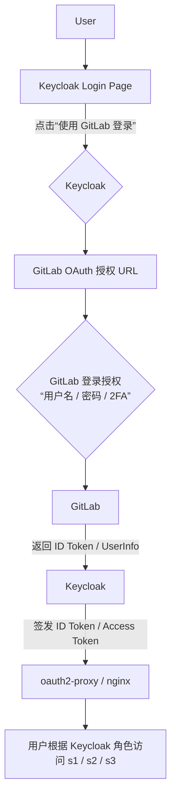

# GitLab (IdP) + Keycloak（作为授权服务 / broker） + oauth2-proxy/nginx
[English](/keycloak-gitlab-oauth2proxy.md) | [Japanese](/ja/keycloak-gitlab-oauth2proxy.md) | [Chinese](/zh/keycloak-gitlab-oauth2proxy.md)
## 简介

本指南提供了将 GitLab 作为身份提供者（IdP）与 Keycloak（作为授权服务和身份代理）集成，并通过 oauth2-proxy 和 Nginx 进行保护的全面概述和详细步骤。此设置旨在利用现有的 GitLab 身份验证，同时通过 Keycloak 增强授权功能。

### 核心原则：

*   ✅ **GitLab** 负责 **身份认证 (AuthN)**。
*   ✅ **Keycloak** 负责 **授权管理 (AuthZ)**。
*   ✅ **Keycloak** 充当一个 **身份中介层 (Identity Broker)**，在用户登录时“信任”GitLab 签发的身份结果，并在本地建立或同步用户资料与角色。

## 1. 目标与要求

### 1.1 目的：

1.  继承利用现行 GitLab 作为认证服务提供者，为同根域名下的其他各子域名对应的 Web 服务提供统一认证服务。
2.  增强基于角色的访问控制 (RBAC) 功能，对用户权限进行细粒度的控制。

### 1.2 要求：

1.  对以项目组为单位的 Web 服务（例如 Resin 服务），提供角色/组访问权限控制。
2.  对以用户为单位的 Web 服务（例如 Resin 服务），提供用户/组访问权限控制。

## 2. 解决方案概述

### 2.1 提议的解决方案：

*   Keycloak 作为 Identity Broker，对接 GitLab OAuth（即 GitLab 登录 → Keycloak Token → 你的应用）。
*   不需要手动导入用户，用户继续使用 GitLab 账户登录（含 2FA）。

### 2.2 优点：

*   Keycloak 负责 RBAC 和时间策略。
*   GitLab 保留现有用户与 2FA 配置。
*   无需用户密码迁移。
*   功能完整：用户/组/角色管理、细粒度授权（资源、权限、策略），并可使用 JavaScript 编写条件逻辑（例如基于时间的条件）。
*   支持将 GitLab 作为 Identity Broker：用户使用 GitLab 登录，但 Keycloak 管理角色和权限。
*   活跃的社区和丰富的文档有助于管理后台、审计和临时授权（例如，通过 Admin API 脚本实现“按期间”自动分配/撤销角色）。

### 2.3 高层架构图：

用户 ──▶ Nginx ─▶ oauth2-proxy ─▶ Keycloak (Identity Broker) ─▶ GitLab (IdP)

### 2.4 高层登录流程：

Web 服务 → oauth2-proxy → Keycloak → GitLab 登录（OAuth）→ 返回 Token → Web 服务。

**结果：**

*   用户的认证仍然在 GitLab。
*   Keycloak 生成自己的 Token 并颁发给 oauth2-proxy。
*   可以在 Keycloak 中给这些“外部登录用户”分配角色和策略。

## 3. 核心概念

### 3.1 GitLab 与 Keycloak 功能对比：

| 功能                             | GitLab                                       | Keycloak                                                                   |
| :------------------------------- | :------------------------------------------- | :------------------------------------------------------------------------- |
| 用户认证（用户名/密码、OAuth2）    | ✅ 支持本地用户、LDAP、SAML、2FA                   | ✅ 支持本地用户、LDAP、SAML、OTP、FIDO2、WebAuthn                  |
| OAuth2 / OIDC 提供者             | ✅ 内置提供者（功能有限）                          | ✅ 完整支持，包括 Access Token、Refresh Token、UMA、资源策略 |
| 用户分组/角色                      | ✅ 基于项目/组                                 | ✅ 可自定义 Realm 角色 / Client 角色 / 组，层次化              |
| 细粒度访问控制（RBAC / ABAC）    | ❌ 几乎没有                                   | ✅ 强大，内置策略 / 权限模型，可扩展 JS 条件（例如基于时间的）            |
| 身份联邦（与其他 IdP 对接）        | ✅ 可以作为 IdP，也可对接外部 IdP                  | ✅ 可以作为 IdP，也可 **作为 Broker** 对接 GitLab、Google、Azure AD 等   |
| 多因素认证（2FA/MFA）            | ✅ TOTP (Google Authenticator) + WebAuthn | ✅ TOTP, WebAuthn (FIDO2), SMS/Email, OTP (可扩展)             |

### 3.2 理解 Keycloak 作为“身份中介层”

“Identity Broker（身份代理/身份中介）” 是 **Keycloak 的一项核心功能**。它是一个中间件，
它的作用是让 Keycloak 可以 **信任外部身份提供者（IdP）** 并为其签发自己的 token。

#### 类比：机场安检的双层签发

可以把登录流程想象成一个机场安检的“双层签发”：

1.  ✈️ **GitLab 是护照签发机构**：
    *   它验证用户是谁（账号、密码、2FA），然后说“这是合法用户 A”。

2.  🛂 **Keycloak 是边境检查官（Broker）**：
    *   它信任护照的真实性（通过 OAuth2 / OIDC 验证签名），并决定这位旅客能去哪些区域（RBAC 角色）。
    *   它再签发自己系统内部用的“登机证”（Access Token / ID Token）。
    *   这个 Token 里带有角色、权限等信息。

3.  🧱 **Nginx + oauth2-proxy 或后端服务只认 Keycloak 的 Token**。
    *   它不需要知道 GitLab 存在。

### 3.3 详细登录流程（时序图）

```mermaid
sequenceDiagram
    participant User
    participant Nginx
    participant Oauth2Proxy
    participant Keycloak
    participant GitLab

    User->>+Nginx: ① 访问 https://s1.web.local
    Nginx->>Oauth2Proxy: ② 转发请求
    Oauth2Proxy-->>Keycloak: ③ 无会话，重定向到 Keycloak 登录页
    Keycloak->>User: Keycloak 登录页
    User->>Keycloak: ④ 点击“使用 GitLab 登录”
    Keycloak->>+GitLab: ⑤ 重定向用户到 GitLab 登录
    GitLab->>User: GitLab 登录页（凭据 + 2FA）
    User->>GitLab: ⑥ 输入凭据 + 2FA 验证通过
    GitLab-->>-Keycloak: ⑦ 返回授权码
    Keycloak->>GitLab: ⑧ 使用授权码获取用户信息（email, name 等）
    Keycloak->>Keycloak: ⑨ 创建/更新内部用户映射（无密码，引用 GitLab）
    Keycloak-->>-Oauth2Proxy: ⑩ 颁发 Access Token / ID Token
    Oauth2Proxy->>Oauth2Proxy: ⑪ 验证 token
    Oauth2Proxy->>Nginx: 允许访问
    Nginx->>User: ⑫ 用户成功访问 Web 服务（resin pro / filebrowser / 其他服务）
```



### 3.4 身份中介层数据流与用户同步

#### 用户信息同步逻辑：

当 GitLab 用户第一次通过 Keycloak 登录时：

*   Keycloak 会从 GitLab 获取：
    *   `email`
    *   `username`
    *   `name` (`display_name`)
    *   `avatar_url`
    *   `GitLab ID` (`sub` claim)

*   Keycloak 然后在内部创建一个“联邦用户”，指定为“中介用户”。
    *   （你会在管理控制台中看到这个用户，标记为“Federated”。）
*   下次该用户再登录时，Keycloak 会自动识别他们（通过 GitLab 的 `sub` claim）并更新他们的信息。
*   Keycloak 不需要主动定期同步 GitLab 用户表。它会在用户首次登录时 **按需创建**，之后自动维护。这被称为 **“即时用户创建 (Just-In-Time Provisioning)”**。

## 4. 详细配置步骤

### 4.1 步骤 1：配置 Keycloak 作为 GitLab 的身份中介层

#### 4.1.1 在 GitLab 中注册 Keycloak 作为 OAuth 应用程序

**路径：** `GitLab → 管理员 → 应用程序` (或 `用户设置 → 应用程序`)

**填写：**

| 字段           | 值                                                              |
| :------------- | :----------------------------------------------------------------- |
| 名称           | `keycloak-broker`                                                  |
| 重定向 URI     | `https://keycloak.example.com/realms/yourrealm/broker/gitlab/endpoint` |
| 范围           | `read_user openid profile email`                                   |

**获取：**

*   客户端 ID
*   客户端 Secret

#### 4.1.2 在 Keycloak 中配置 GitLab 身份提供者

**路径：** `登录 Keycloak 管理控制台 → 创建新的 Realm（例如 my-realm） → 进入 Realm`
`→ 身份提供者 → 添加提供者 → 选择“OpenID Connect v1.0”（如果直接有“GitLab”选项则选择）`

**填写：**

| 设置项              | 值                                                          |
| :------------------ | :------------------------------------------------------------- |
| 别名                | `gitlab`                                                       |
| 显示名称            | `使用 GitLab 登录`                                            |
| 授权 URL            | `https://gitlab.its2.mbpsmartec.co.jp/oauth/authorize` (或你的自托管 GitLab 地址) |
| Token URL           | `https://gitlab.its2.mbpsmartec.co.jp/oauth/token`             |
| 用户信息 URL        | `https://gitlab.its2.mbpsmartec.co.jp/api/v4/user`             |
| 客户端 ID           | (上一步从 GitLab 获取的 ID)                                    |
| 客户端 Secret       | (上一步从 GitLab 获取的 Secret)                                |
| 默认范围            | `read_user openid profile email`                               |
| 存储 Token          | ✅ 启用                                                      |

保存后，Keycloak 登录页面会自动出现“使用 GitLab 登录”按钮。

#### 4.1.3 启用自动用户创建和邮箱映射

*   在身份提供者设置中，勾选以下选项：
    *   `同步模式: IMPORT`
    *   `信任邮箱`
    *   `存储 Token`
    *   `同步模式: 首次登录时`

这确保了 Keycloak 会在用户首次登录时自动导入并保存其基本资料。

#### 4.1.4 分配 Keycloak 本地角色

一旦 GitLab 用户首次登录，Keycloak 中将出现相应的用户。然后你可以导航到：

`Keycloak → 用户 → (选择用户) → 角色映射`

在这里，你可以为用户分配访问 `s1/s2/s3` 等服务的权限。你还可以创建策略来控制访问，例如将特定的 GitLab 组映射到 Keycloak 角色，或根据时间动态授予授权。

### 4.2 步骤 2：为 oauth2-proxy 配置 Keycloak 客户端

#### 4.2.1 在 Keycloak 中创建客户端

**路径：** `登录 Keycloak 管理控制台 → 选择相应的 Realm`
`→ 客户端 → 创建客户端`

**填写：**

*   客户端 ID: `oauth2proxy`
*   客户端协议: `openid-connect`
*   访问类型: `confidential`
*   有效重定向 URI:
    *   `https://s1.web.local/oauth2/callback`
    *   `https://s2.web.local/oauth2/callback`
    *   `https://s3.web.local/oauth2/callback`

#### 4.2.2 配置 oauth2-proxy

1.  在 Keycloak 客户端的“凭据”选项卡中，复制客户端 Secret。
2.  在 oauth2-proxy 配置中，设置以下内容：
    *   `provider = "oidc"`
    *   `oidc_issuer_url = "https://keycloak.local/realms/myrealm"`
    *   `oidc_client_id = "oauth2proxy"`
    *   `oidc_client_secret = "xxxxxxxxxxxx"` (从 Keycloak 复制的客户端 Secret)
    *   `redirect_url = "https://s1.web.local/oauth2/callback"`
    *   `scope = "openid email profile"`
    *   `email_domains = ["*"]`
    *   `cookie_secret = "RANDOM_32_BYTE_KEY"`

## 5. 高级配置

### 5.1 在 Keycloak 中启用 OTP

1.  登录 Keycloak Master Realm 管理控制台。
2.  切换到你的目标 Realm。
3.  导航到 `认证 → 流程 → 浏览器`。确认流程结构：

    ```
    用户名密码表单
    ↓
    OTP 表单
    ```

    如果存在 `OTP 表单`，将其 `要求` 更改为 `REQUIRED`。如果不存在 `OTP 表单`：
    *   点击右上角的“添加执行”。
    *   从列表中选择 `OTP 表单`。
    *   保存，然后将其 `要求` 更改为 `REQUIRED`。

这意味着所有通过浏览器登录的用户都将被要求使用 OTP。

4.  **登录时绑定 OTP：**
    *   注销并重新登录管理控制台。
    *   系统将提示：“配置 OTP，使用你的身份验证器应用扫描此二维码。”
    *   扫描二维码并输入一次验证码。
    *   从现在开始，所有登录都将需要你的密码和 OTP。

### 5.2 更高的安全措施

| 项目                         | 说明                                                               |
| :--------------------------- | :------------------------------------------------------------------------ |
| 🔑 **管理控制台限制**         | 使用 Nginx / 防火墙限制对 `/auth/admin/` 的访问仅限于内部网络。 |
| 🧩 **强制密码策略**           | 在 `Realm 设置 → 密码策略` 中，强制执行强密码要求和定期更新。 |
| 🧱 **禁用直接访问**           | 禁用对 Master Realm 的公共客户端访问。                         |
| 📦 **外部 Secret**            | 将管理员密码/OTP 密钥存储在 Vault 或 Azure Key Vault 中。             |

### 5.3 Keycloak 代理模式解释

| 模式                | 说明                                                                                                                                                | 用例                                          |
| :------------------ | :--------------------------------------------------------------------------------------------------------------------------------------------------------- | :------------------------------------------------ |
| **`none`**          | Keycloak 直接暴露在公共网络中，没有代理层，完全自行处理 HTTPS。                                                | 仅用于开发/测试（例如 `start-dev`）。 |
| **`edge`**          | 最常见。Keycloak 假定它位于反向代理（例如 Nginx）之后，代理终止 HTTPS，然后转发 HTTP。Keycloak 信任 `X-Forwarded-*` 头。 | ✅ 推荐用于 Nginx、Traefik、HAProxy 等。  |
| **`reencrypt`**     | 表示反向代理与 Keycloak 之间的通信仍然使用 HTTPS（代理重新加密并转发）。Keycloak 仍然信任 `X-Forwarded-*`。 | 用于 Nginx→Keycloak 通信也使用 HTTPS（例如带有证书的内部网络）。 |
| **`passthrough`**   | 不进行任何协议处理；Keycloak 直接处理外部 HTTPS 连接（很少使用）。                                                                   | 特殊高安全环境。               |

### 5.4 扩展：通过 Keycloak 实现 GitLab SSO

要让 GitLab 本身使用 Keycloak 进行单点登录 (SSO)：

*   在 GitLab 中：导航到 `管理员 → 设置 → 集成 → 启用 OIDC / SAML`。
*   填写 Keycloak 的元数据。

此配置实现了“公司内部统一登录入口：Keycloak”，适用于包括 GitLab 在内的所有内部系统。

## 6. 常见问题排查

### 6.1 邮箱未验证错误

**错误：** `Error redeeming code during OAuth2 callback: email in id_token (xg.wang@mbpsmartec.co.jp) isn't verified.`

**原因：**
*   OAuth2-Proxy 默认要求 ID Token 中的邮箱必须经过验证 (`email_verified=true`)。
*   Keycloak 在其设置中选择了 `email_verified=true`。

**解决方案：**
*   **OAuth2-Proxy 配置：** 在 oauth2-proxy 配置中添加 `insecure_oidc_allow_unverified_email = true`。
*   **Keycloak Realm 设置：** 在 `Realm → 登录 → 邮箱设置` 中，将 `验证邮箱 = false`。

### 6.2 将 GitLab 设置为默认 IdP 并自动重定向

**问题：** 你希望 Keycloak 作为身份中介层，将 GitLab 设置为默认身份提供者并自动重定向，而不显示用户名/密码输入字段。

**解决方案：** 这可以通过自定义认证流程实现。

*   在 `认证 → 流程` 中，复制“浏览器”流程以创建一个新流程（例如 `browser-login-by-gitlab`）。
*   向此新流程添加一个“身份提供者重定向器”执行。
*   配置“身份提供者重定向器”以设置 `默认身份提供者 = gitlab`（使用你为 GitLab IdP 配置的别名）。
*   **关键是，将此自定义流程与你的客户端（例如 oauth2-proxy 客户端）关联起来**。其他客户端仍然可以使用默认的用户名/密码登录。
    *   客户端 `→ 设置（高级） → 认证流程覆盖 → 浏览器流程 = browser-login-by-gitlab`。

### 6.3 理解“身份提供者重定向器”

根据官方文档：
当使用 IdP 联邦（即 Keycloak 作为 Broker 委托认证给外部 IdP）时，Keycloak 默认会在登录页面显示一个用户名/密码表单以及外部 IdP 登录按钮。
如果你希望 **跳过用户名/密码表单** 并 **自动将用户重定向到已配置的外部 IdP**（例如你的 GitLab 登录按钮），那么请使用“身份提供者重定向器”执行器。
通过在登录流程（浏览器流程）中添加和配置“身份提供者重定向器”，Keycloak 将在登录界面自动重定向到指定的 IdP，而不是首先显示本地用户名/密码表单。

### 6.4 首次登录时用户创建/关联问题

**问题：** 首次访问 Web 服务时，用户被重定向到 GitLab 登录页面。在 GitLab 成功授权后，他们被重定向回 Keycloak，然后 Keycloak 要求输入用户名/密码，未能自动创建或链接用户，从而阻止了进一步的认证。

**可能的原因和检查点：**

*   **Keycloak 身份提供者高级设置检查：**
    *   导航到 `身份提供者 → GitLab`（你配置的 IdP） `→ 高级设置`。
    *   确认：
        *   `首次登录流程覆盖: first broker login`
        *   `同步模式: Import`
*   **Keycloak 认证流程检查 (`First Broker Login`)：**
    *   导航到 `认证 → 流程 → First Broker Login`（如果配置了自定义流程，则使用你的自定义流程）。如果未设置自定义流程，则使用默认值。
    *   检查它是否包含“如果唯一则创建用户”执行项，并确保其 `要求` 是 `REQUIRED` 或 `ALTERNATIVE`。
    *   检查它是否包含“自动设置现有用户”执行项。
    *   检查“审查配置文件”或“首次登录时更新配置文件”是否设置为“开”，以允许用户补充缺失信息。

### 6.5 设置流程：在 Realm 中启用“身份提供者重定向器”

以下是一个推荐的详细步骤，适用于 Realm（例如 `intra-mart`）使用 GitLab 作为外部 IdP 的环境。

1.  **确认已配置外部 IdP：**
    *   在你的 Realm（例如 `intra-mart`）中：`身份提供者 → 添加提供者`（选择 OIDC 或 GitLab）。
    *   填写 GitLab 的客户端 ID / Secret、授权端点、用户信息端点等。
    *   确保“启用”已勾选。

2.  **创建或修改浏览器登录流程：**
    *   从左侧菜单：`认证 → 流程`。
    *   找到“浏览器”流程（默认流程）或复制它以创建一个新流程（例如 `browser-idp-only`），以避免影响其他客户端。
    *   在此流程中：添加一个新的执行项“身份提供者重定向器”（点击“添加执行”）。
    *   将“身份提供者重定向器”的 `要求` 更改为 `REQUIRED`。
    *   点击此执行项右侧的“⚙ (配置)”图标进行配置：
        *   `别名`：将其设置为你在 `身份提供者` 中为 GitLab 定义的“别名”值（例如 `gitlab`）。
        *   `默认身份提供者`：也填写此别名（例如 `gitlab`）。
        *   （其他选项可用于根据用户域匹配或 `kc_idp_hint` 参数的存在来控制重定向。）

3.  **将客户端指向此登录流程：**
    *   在你的 Realm（例如 `intra-mart`）中：`客户端 → 选择你的客户端`（例如 `oauth2-proxy 客户端`）。
    *   在 `设置` 或 `认证流程覆盖` 部分：将 `浏览器流程` 设置为你刚刚创建或修改的流程（例如 `browser-idp-only`）。
    *   保存。
