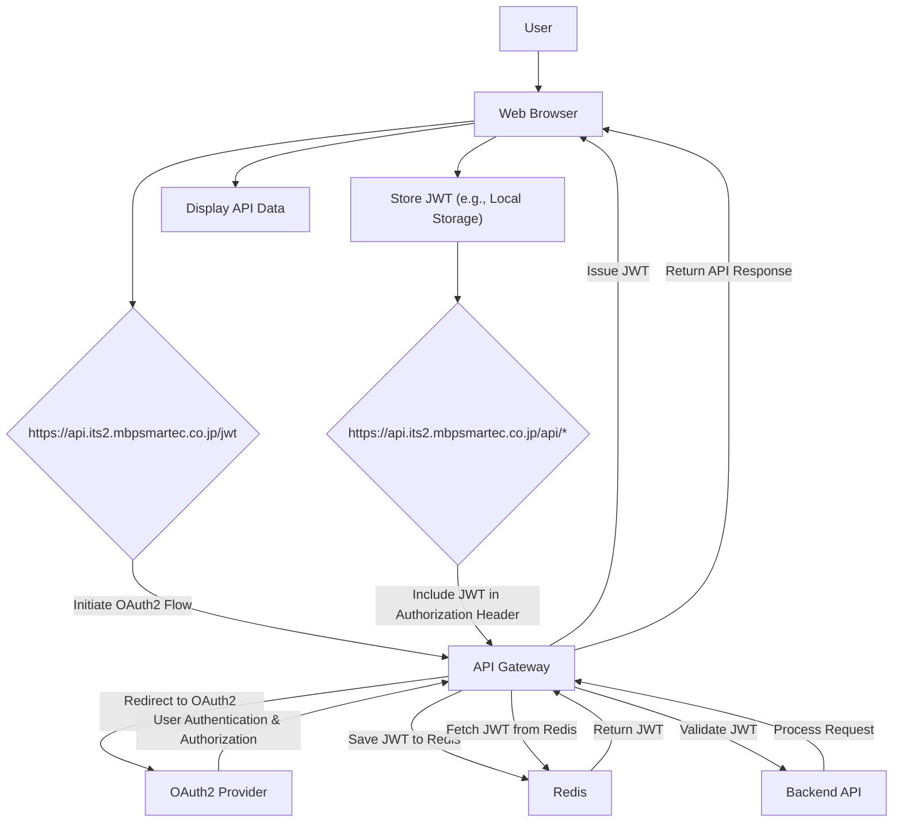
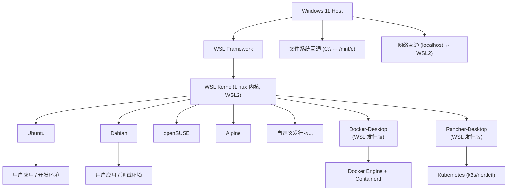

# jwt + oauth2 认证方式下的api-gateway访问管理流程图

```mermaid
graph TD
A[User] --> B[Web Browser]
B --> C{"https://api.its2.mbpsmartec.co.jp/jwt"}
C -- "Initiate OAuth2 Flow" --> D[API Gateway]
D -- "Redirect to OAuth2 Provider" --> E[OAuth2 Provider]
E -- "User Authentication & Authorization" --> D
D -- "Issue JWT" --> B
D -- Save JWT to Redis --> J[Redis];
B --> F["Store JWT (e.g., Local Storage)"]
F --> G{"https://api.its2.mbpsmartec.co.jp/api/*"}
G -- "Include JWT in Authorization Header" --> D
D -- Fetch JWT from Redis --> J;
J -- Return JWT --> D;
D -- "Validate JWT" --> H[Backend API]
H -- "Process Request" --> D
D -- "Return API Response" --> B
B --> I[Display API Data]
```

# WSL 架构图

```mermaid
graph TD
A[Windows 11 Host] --> B[WSL Framework]
B --> C["WSL Kernel(Linux 内核, WSL2)"]
C --> D1[Ubuntu]
C --> D2[Debian]
C --> D3[openSUSE]
C --> D4[Alpine]
C --> D5["自定义发行版..."]
C --> E1["Docker-Desktop <br> (WSL 发行版)"]
C --> E2["Rancher-Desktop <br> (WSL 发行版)"]
D1 --> F1[用户应用 / 开发环境]
D2 --> F2[用户应用 / 测试环境]
E1 --> G1["Docker Engine + Containerd"]
E2 --> G2["Kubernetes (k3s/nerdctl)"]
A --> H["文件系统互通 (C:\ ↔ /mnt/c)"]
A --> I["网络互通 (localhost ↔ WSL2)"]
```